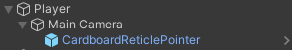
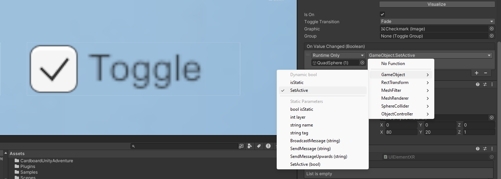

# Curso Cardboard
## Unity 2022

### Capítulo 1 📖

🔗 [Ver video tutorial gratis en YouTube](https://youtu.be/CwgOl1JAyeY) 🎥


- En este momento, la versión descargada del SDK de Cardboard es **v1.26.0**.  
Al instalarlo, Unity solicitará activar el nuevo sistema de entrada (Input System). Es necesario aceptar, y Unity se reiniciará automáticamente. 🔄


- **Minium API Level**: Android 8.0 "Oreo" (API level 26).  
- **Target API Level**: Android 13.0 (API level 33)

- No es necesario modificar el archivo `AndroidManifest`. ✅

📌 **Nota importante:** Desde la grabación del video, el SDK ha tenido algunos cambios. Para probar la escena y activar las interaciones, será necesario realizar algunos pasos adicionales:  

1. Abre el menú **Layers** y selecciona **Edit Layers...**.  
2. Define una nueva capa llamada **"Interactive"**.  
3. Haz clic en el objeto **Treasure GameObject** para abrir la ventana del Inspector.  
   - Asigna su capa a **"Interactive"**.  
   - Si aparece una ventana emergente preguntando si deseas aplicar el cambio a los objetos secundarios, selecciona **"Yes, change children"**. ✅  
4. Haz clic en **Player > Camera > CardboardReticlePointer GameObject** para abrir el Inspector.  
   - En el script **"Cardboard Reticle Pointer"**, selecciona **"Interactive"** como la máscara de capa de interacción (Reticle Interaction Layer Mask). 🎯  

Al hacer esto el SDK te permitira utilizar el recticle:
- Estado normal 🔴
- Al entrar en contacto con un objeto interactable: ⭕


¡Listo! Ahora tu proyecto debería estar configurado correctamente. 🚀

### Capítulo 2 📖

🔗 [Ver video tutorial gratis en YouTube](https://youtu.be/q5AvXfoGAyg) 🎥

En la nueva versión del SDK, la cámara incluye como hijo una nueva implementación llamada `CardboardReticlePointer`, que reemplaza al antiguo `CameraPointer`.  

Para seguir el tutorial del video, es necesario **desactivar** o **eliminar** el prefab `CardboardReticlePointer` en la jerarquía:  

  

📌 En el video, se utiliza el antiguo `CameraPointer` como base.  
Para seguir el tutorial al pie de la letra, aquí tienes el código de `CameraPointer`:

```csharp
using System.Collections;
using UnityEngine;

public class CameraPointer : MonoBehaviour
{
    private const float _maxDistance = 10;
    private GameObject _gazedAtObject = null;

    public void Update()
    {

        RaycastHit hit;
        if (Physics.Raycast(transform.position, transform.forward, out hit, _maxDistance))
        {
            if (_gazedAtObject != hit.transform.gameObject)
            {
                _gazedAtObject?.SendMessage("OnPointerExit");
                _gazedAtObject = hit.transform.gameObject;
                _gazedAtObject.SendMessage("OnPointerEnter");
            }
        }
        else
        {
            _gazedAtObject?.SendMessage("OnPointerExit");
            _gazedAtObject = null;
        }
        if (Google.XR.Cardboard.Api.IsTriggerPressed)
        {
            _gazedAtObject?.SendMessage("OnPointerClick");
        }
    }
}
```

👾 **Tips adicionales**: 
- Este código permite manejar eventos como `OnPointerEnter`, `OnPointerExit` y `OnPointerClick` para los objetos con los que el usuario interactúa en la escena.  
- Recuerda que para interactuar con objecto debes agregarle un collider y el tag `Interactable`

### Capítulo 3 📖

🔗 [Ver video tutorial gratis en YouTube](https://youtu.be/hu1bMy6woN8) 🎥

Este capítulo se seguir sin ningún problema, no existe cambio alguno. ✨

Recuerda que al momento de crear la interacción de los objetos a partir de los toggles, se debe seleccionar la opción `SetActive` de la parte superior, en donde está `Dynamic bool`.

  