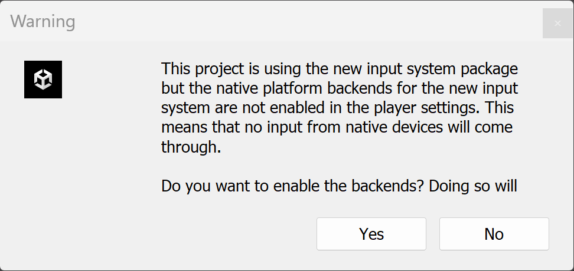
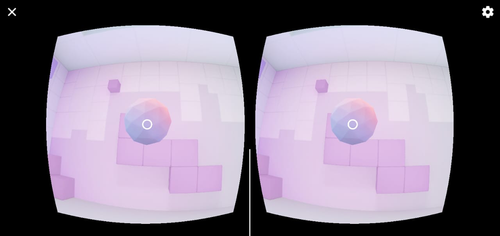

# Curso Cardboard
## Unity 2022

### Capítulo 1 📖

- En este momento, la versión descargada del SDK de Cardboard es **v1.26.0**.  
Al instalarlo, Unity solicitará activar el nuevo sistema de entrada (Input System). Es necesario aceptar, y Unity se reiniciará automáticamente. 🔄

- **Minium API Level**: Android 8.0 "Oreo" (API level 26).  
- **Target API Level**: Android 13.0 (API level 33)

- No es necesario modificar el archivo `AndroidManifest`. ✅

📌 **Nota importante:** Desde la grabación del video, el SDK ha tenido algunos cambios. Para probar la escena y activar las interaciones, será necesario realizar algunos pasos adicionales:  

1. Abre el menú **Layers** y selecciona **Edit Layers...**.  
2. Define una nueva capa llamada **"Interactive"**.  
3. Haz clic en el objeto **Treasure GameObject** para abrir la ventana del Inspector.  
   - Asigna su capa a **"Interactive"**.  
   - Si aparece una ventana emergente preguntando si deseas aplicar el cambio a los objetos secundarios, selecciona **"Yes, change children"**. ✅  
4. Haz clic en **Player > Camera > CardboardReticlePointer GameObject** para abrir el Inspector.  
   - En el script **"Cardboard Reticle Pointer"**, selecciona **"Interactive"** como la máscara de capa de interacción (Reticle Interaction Layer Mask). 🎯  

Al hacer esto el SDK te permitira utilizar el recticle:
- Estado normal 🔴
- Al entrar en contacto con un objeto interactable: ⭕

¡Listo! Ahora tu proyecto debería estar configurado correctamente. 🚀
